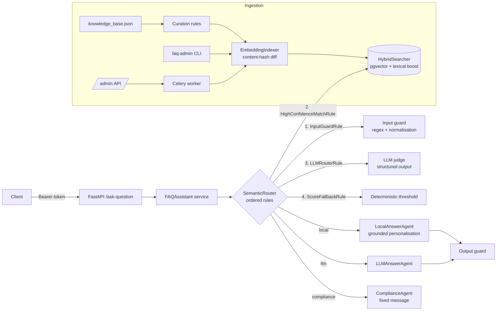

# Semantic FAQ Assistant

A FastAPI service that answers user questions from a curated FAQ knowledge base. It uses
**hybrid semantic search** (pgvector), an **agentic semantic router** built on LangChain, and
**guardrails** against prompt injection. When the knowledge base has no answer, it falls back
to an LLM, and it refuses out-of-scope or abusive questions through a Compliance Agent.

```
POST /ask-question  {"user_question": "Where do I download my invoices?"}
→ {"source": "local", "matched_question": "Where can I download invoices?",
   "answer": "Billing -> Invoices. Click an invoice to download as PDF.",
   "category": "billing", "similarity_score": 0.9026}
```

---

## Contents

1. [Quick start](#quick-start)
2. [Architecture](#architecture)
3. [Knowledge base & embeddings](#knowledge-base--embeddings)
4. [Similarity search](#similarity-search)
5. [Semantic router (agentic decision function)](#semantic-router)
6. [Guardrails & prompt-injection defence](#guardrails)
7. [Error handling](#error-handling)
8. [API](#api)
9. [Managing the embeddings database](#managing-the-embeddings-database)
10. [Configuration & swapping models/providers](#configuration)
11. [Development workflow](#development)
12. [Evaluating quality](#evaluating-quality)
13. [Limitations & next steps](#limitations--next-steps)

---

## Quick start

### Option A: Docker Compose (Postgres + pgvector, Redis, API, Celery worker)

```bash
cp -n .env.example .env       # -n: never overwrite an existing .env; then set OPENAI_API_KEY, API_TOKENS, ADMIN_TOKENS, CHAT_MODEL
docker compose up --build -d  # db → migrate (schema + embeddings) → api + worker
curl -s localhost:8000/ask-question \
  -H "Authorization: Bearer $API_TOKEN" -H "Content-Type: application/json" \
  -d '{"user_question": "How do I reset my account?"}'
```

The one-shot `migrate` service runs `faq-admin init-db && faq-admin sync`. It can be re-run
at any time; unchanged items cost no tokens. Interactive docs are at
<http://localhost:8000/docs>.

### Option B: Local, no database (in-memory vector store)

```bash
uv sync
cp -n .env.example .env        # then set OPENAI_API_KEY and VECTOR_STORE=memory in .env
uv run uvicorn faq_assistant.main:create_app --factory --reload
```

Requires Python 3.12+ and [uv](https://docs.astral.sh/uv/). The in-memory store embeds the
knowledge base at startup, which takes one batched embedding request.

---

## Architecture



```
src/faq_assistant/
├── api/                 # HTTP layer: routers, schemas, auth dependencies, error mapping
├── agents/              # Responders: LocalAnswerAgent, LLMAnswerAgent, ComplianceAgent
├── routing/             # SemanticRouter + pluggable RoutingRule implementations
├── retrieval/           # HybridSearcher (dense max-sim + bounded lexical boost)
├── knowledge_base/      # Cleaning/quality rules, loader/curation, incremental indexer
├── storage/             # VectorStore protocol; pgvector + in-memory implementations
├── guardrails/          # Input guard (injection heuristics) and output guard
├── llm/                 # Model factory, prompts, chains, provider-error translation
├── services/            # FAQAssistant orchestration
├── worker/              # Celery app + async embedding task
├── evaluation.py        # Retrieval/routing metrics
├── container.py         # Composition root (dependency wiring)
├── cli.py               # `faq-admin` management CLI
├── config.py            # pydantic-settings configuration
└── main.py              # FastAPI app factory
```

**Design principles**

- **Dependency inversion.** Business logic depends on small interfaces: `VectorStore`,
  LangChain `Embeddings`, and typed `Runnable` chains. `container.py` is the only place
  that picks concrete implementations. That keeps models, providers, stores and prompt
  strategies swappable, and tests need no network access.
- **Fail safe, degrade gracefully.** Every model call goes through `upstream_call()`, which
  turns provider-specific failures into domain errors. Every optional LLM step has a
  deterministic fallback.
- **Untrusted by default.** User input and model output are both treated as untrusted data.

---

## Knowledge base & embeddings

The provided data contains deliberate "gotchas". These are handled by a small pipeline of
pure quality rules (`knowledge_base/cleaning.py`) that runs at ingestion. Run
`faq-admin validate` to see the report without calling any API.

| Issue in the data | Handling | Severity |
|---|---|---|
| `"x"`: a placeholder question that matches nothing and everything | rejected (`question_too_short`) | error |
| `help!!! 😭😭😭 my account is locked` / `pls help me unlock it ASAP!!! 🔓` (the answer is a user plea) | rejected (`answer_not_informative`) | error |
| Emoji and repeated punctuation in questions | stripped from the text used for search (`noisy_question`) | warning |
| Compromised-account answer recommends literal passwords (`"Secure!Pass123"`) | unsafe sentence removed (`literal_password_example`) | warning |
| Non-ASCII hyphens (`Two‑Factor`, `6‑digit`), NBSP, smart quotes, zero-width chars | NFKC + explicit translation table | — |
| Inconsistent categories | normalised to `snake_case`, kept as metadata | — |
| Exact duplicate questions | later duplicates rejected (`duplicate_question`) | error |

The result is **31 of 33** entries indexed. Rejected entries are reported rather than
silently dropped.

**Two representations per entry (multi-vector).**

| Vector | Text | Why |
|---|---|---|
| `question_embedding` | cleaned question | precise question-to-question matching |
| `document_embedding` | `Topic: … / Question: … / Answer: …` | recall for terse keyword entries (`Edit avatar?`, `Upgrade my plan`), where the answer and topic carry the meaning |

The query is preprocessed with the **same** `to_search_text()` function used for the
questions, so both sides share one text distribution.

**Metadata.** `category`, the cleaned `search_question`, `quality_flags`, a stable id
(`uuid5(collection + normalised question)`), and a `content_hash` used for incremental
updates.

**Storage.** PostgreSQL with `pgvector`, two `VECTOR(n)` columns with **HNSW cosine
indexes**, and a `collections` table that records which embedding model each collection
uses. Mixing models inside one collection is refused, because the vectors would not be
comparable.

---

## Similarity search

`retrieval/search.py`:

1. **Dense retrieval.** Two index-backed kNN scans run, one per representation. They are
   `UNION`ed, and each item keeps its max cosine similarity (max-sim).
2. **Bounded lexical boost.** Query terms are compared with the FAQ question and category
   (stop-words removed, light stemming):

   `score = dense + w · lexical · (1 − dense)` with `w = 0.2`

   The boost can only **raise** a score, never lower it. Paraphrases with no words in
   common are not penalised, and exact-term matches ("2FA", "passkeys", "invoices") are
   rewarded. Because the score stays in `[dense, 1]`, thresholds remain interpretable.

Measured on the bundled evaluation set with `text-embedding-3-small`
(see [Evaluating quality](#evaluating-quality)): the lexical boost does not change the
ranking, but it moves correct matches into higher-confidence bands. At a 0.60 cut-off it
answers 22 correct cases instead of 18.

---

## Semantic router

`routing/router.py`. The decision function is an **ordered chain of `RoutingRule`s**. Each
rule either decides or abstains (`None`). Adding a policy means adding one class; for
example, `tests/unit/test_router.py::test_router_is_extensible_with_custom_rules` does
exactly that.

| # | Rule | Decides | Why it is here |
|---|---|---|---|
| 1 | `InputGuardRule` | `compliance` | Deterministic injection and abuse filter. Runs **before** retrieval, so blocked input costs nothing. |
| 2 | `HighConfidenceMatchRule` (score ≥ 0.85) | `local` | Clear hits skip the LLM, saving tokens and latency. |
| 3 | `LLMRouterRule` | `local` / `llm` / `compliance` | **Agentic judge.** It sees the top candidates (short ids `c1..c3`, question, category, answer) and returns a Pydantic-validated `RouterVerdict {route, faq_id, is_prompt_injection, reasoning}`. It checks intent (not just shared keywords), scope (IT/support vs. anything else → Compliance Agent), and manipulation attempts. |
| 4 | `ScoreFallbackRule` (score ≥ 0.60) | `local` / `llm` | Deterministic backup if the LLM judge is down, returns malformed output, or **hallucinates a candidate id**. |

Retrieval is lazy and memoised per request (`RoutingContext.hits()`), so rules share one
search.

**Why an LLM judge and not only a threshold?** The evaluation shows that
`text-embedding-3-small` scores are compressed. A wrong match ("change my profile picture" →
"change my profile information") scores **0.82**, and most correct matches fall between
0.55 and 0.80. No single threshold separates them. The correct entry is, however, in the
**top 5 for 100 %** of cases (hit@5 = 1.0), so the judge chooses among candidates with
full recall.

**Answering agents** (`agents/responders.py`):

- `LocalAnswerAgent` rewrites the curated answer to address the user's wording (the
  "personalised" requirement). The prompt allows only facts from the reference answer. If
  the LLM fails or its output fails the output guard, the **curated answer is returned
  verbatim**, because the knowledge base is the source of truth.
- `LLMAnswerAgent` gives general, platform-neutral guidance for in-scope questions. It is
  told not to invent product-specific menus, prices or contact details.
- `ComplianceAgent` returns *"This is not really what I was trained for, therefore I cannot
  answer. Try again."* It is deterministic on purpose: it cannot be talked out of its
  answer, and it doesn't reveal which guard fired.

---

## Guardrails

Defence in depth, since no single layer is sufficient:

| Layer | Where | What |
|---|---|---|
| Schema validation | `api/schemas.py` | `extra="forbid"`, type checks, non-blank, max length (configurable, default 500 chars) |
| Normalisation | `guardrails/input_guard.py` | NFKC, zero-width and control character removal. Defeats trivial obfuscation such as `IGNORE​ THE SYSTEM PROMPT`. |
| Heuristic filter | `guardrails/input_guard.py` | instruction override, system-prompt extraction, role hijack/persona, jailbreak keywords (DAN, developer mode), chat-template tokens (`<\|im_start\|>`, `[INST]`, `system:`), long base64 payloads, non-printable ratio |
| LLM classifier | `LLMRouterRule` | `is_prompt_injection` flag for semantic attacks that regex misses |
| Prompt hardening | `llm/prompts.py` | user text is only in the human turn, inside `<user_question>` tags, and labelled as untrusted data. The instruction hierarchy is explicit, and the model is told never to output secrets or example passwords. |
| Canary token | `llm/prompts.py` | a random per-process canary sits in every system prompt. If it appears in an output, that output is discarded as a prompt leak. |
| Output guard | `guardrails/output_guard.py` | empty or malformed output, prompt leaks, secret patterns (OpenAI/AWS keys, private keys), length cap |
| Data hygiene | `knowledge_base/cleaning.py` | unsafe KB content (literal passwords) is removed before it can be served |
| AuthN/Z | `api/dependencies.py` | bearer tokens via `Depends(get_token)`, constant-time comparison, separate admin tokens |

Refusals always use the same Compliance message, so attackers get no signal about which
guard fired. The reason is logged server-side with the request id.

---

## Error handling

| Situation | Behaviour |
|---|---|
| Provider down, timeout, 5xx, content filter | `UpstreamServiceError` → **503** + `Retry-After` |
| Provider rate limit (any provider: `*RateLimit*` class or HTTP 429) | `UpstreamRateLimitError` → **429** + `Retry-After` |
| Malformed structured output / schema violation / hallucinated FAQ id from the router | router abstains → deterministic fallback |
| Personalisation fails or is unsafe | curated answer returned verbatim |
| LLM answer fails output guard | safe fallback message |
| Embedding vectors of wrong count/dimension | rejected before being stored |
| Vector store unavailable / not indexed | **503**. `/health/ready` reports degraded. |
| Invalid request | **422** with field-level details |
| Anything unexpected | **500** with a generic message and `request_id`; details go only to the logs |

Every response carries an `X-Request-ID` header (propagated if the client sends one), and
every log line includes it. LangChain retries transient failures (`LLM_MAX_RETRIES`) with a
timeout (`LLM_TIMEOUT_SECONDS`).

---

## API

| Method | Path | Auth | Description |
|---|---|---|---|
| `POST` | `/ask-question` | API token | Answer a question |
| `GET` | `/health` | — | Liveness |
| `GET` | `/health/ready` | — | Readiness (vector store reachable) |
| `GET` | `/admin/collections` | admin token | Collections and item counts |
| `POST` | `/admin/collections/{name}/items` | admin token | Queue curation + incremental embedding on Celery (202 + task id) |
| `GET` | `/admin/tasks/{task_id}` | admin token | Job status/result |

`source` values: `local` (FAQ match), `openai` (LLM fallback; the wire value is kept for
contract compatibility even though the model is configurable), and `compliance`.
`category` and `similarity_score` are additive fields beyond the spec example.

---

## Managing the embeddings database

```bash
uv run faq-admin validate                    # curation report (no API calls)
uv run faq-admin init-db                     # CREATE EXTENSION vector + schema + HNSW indexes
uv run faq-admin sync                        # embed only new/changed items
uv run faq-admin sync --collection billing --file billing.json   # new collection
uv run faq-admin sync --prune                # also delete items no longer in the file
uv run faq-admin sync --force                # re-embed everything (e.g. new model)
uv run faq-admin sync --async                # queue on the Celery worker
uv run faq-admin list
uv run faq-admin delete-collection billing --yes
uv run faq-admin search "how do I reset my password"   # inspect scores
uv run faq-admin evaluate [--with-router]
```

**Token efficiency.** Each item's `content_hash` covers the embedding model and every
embedded text. A sync diffs against stored hashes and embeds only new or changed items, in
batches. Re-running a sync on unchanged data makes **zero** embedding calls. Updates never
delete existing data unless `--prune` is passed.

**Async (Celery).** `POST /admin/collections/{name}/items` or `sync --async` enqueues
`faq.sync_collection`. The task is idempotent thanks to hashing, so `acks_late` redelivery
and automatic exponential-backoff retries on rate limits are safe.

---

## Configuration

All settings live in `config.py` (pydantic-settings), are read from the environment or
`.env`, and are validated at startup. See `.env.example`.

**Swapping models or providers** needs no code changes. `llm/factory.py` uses LangChain's
`init_chat_model` / `init_embeddings`:

```bash
CHAT_MODEL=gpt-4.1-mini                              # another OpenAI model
LLM_PROVIDER=anthropic CHAT_MODEL=claude-sonnet-5    # after: uv add langchain-anthropic
EMBEDDING_PROVIDER=ollama EMBEDDING_MODEL=nomic-embed-text EMBEDDING_DIMENSIONS=768
```

Changing the embedding model means re-embedding: use a new collection or run
`sync --force` on a recreated one. The store refuses to mix models.

**Prompting strategies** are isolated in `llm/prompts.py`, and chain composition is in
`llm/chains.py`. Components receive typed `Runnable`s, so a prompt, a model, or a whole
chain (for example, a few-shot router) can be replaced independently.

---

## Development

```bash
make install     # uv sync + pre-commit hooks
make check       # ruff format --check, ruff lint, mypy --strict, pytest
make run         # uvicorn with reload
```

- **Formatting and linting**: ruff (pycodestyle, pyflakes, isort, bugbear, bandit,
  pydocstyle/Google, pylint subset, …). Line length is 100.
- **Typing**: `mypy --strict` over `src` and `tests`.
- **Tests** (97): unit tests for cleaning rules, guardrails (attack and benign corpora),
  indexer token efficiency, hybrid scoring, every router rule and failure mode, responders
  and error translation, evaluation metrics; plus API integration tests for auth, all three
  routes, validation, 503/429 mapping and health. They use deterministic fakes (a
  bag-of-words embedder and `RunnableLambda` chains), so no network or key is needed.
  `tests/integration/test_postgres_store.py` runs against a real pgvector database when
  `TEST_DATABASE_URL` is set.
- **CI**: `.github/workflows/ci.yml` runs the same checks.

---

## Evaluating quality

### What to evaluate, step by step

The system is a pipeline, so each stage gets its own metric. That way a regression can be
traced to one stage instead of showing up only in the final answer.

| Stage | Question | Objective metric | How |
|---|---|---|---|
| 1. Data curation | Is the KB clean and unambiguous? | rejected/flagged counts; near-duplicate pairs with conflicting answers | `faq-admin validate`; review of flagged items |
| 2. Retrieval | Is the right FAQ in the candidates, and ranked first? | **hit@1, hit@k (recall), MRR** | `faq-admin evaluate` on labelled paraphrases |
| 3. Calibration | Where should thresholds sit? | per-threshold **correct / wrong-match / not-in-KB** counts (precision–coverage trade-off) | threshold sweep in `faq-admin evaluate` |
| 4. Routing | Local vs. LLM vs. compliance correct? | **route accuracy**, confusion matrix, correct-match rate for local routes | `faq-admin evaluate --with-router` |
| 5. Safety | Are attacks refused and benign questions allowed? | **attack block rate** and **false refusal rate** on red-team and benign sets | guardrail test corpora + router eval |
| 6. Answer quality | Is the final answer right and useful? | **faithfulness** to the KB answer (no new facts), **completeness** (all steps kept), relevance, tone | LLM-as-judge with a rubric, calibrated against human ratings |
| 7. Operations | Is it fast, cheap and reliable? | p50/p95 latency, tokens and requests per question, fallback and error rates | request-id logs / tracing (e.g. LangSmith) |

**Objective quality** (stages 2–5, 7) is measured automatically against labelled data and
should run in CI with thresholds that fail on regressions. **Subjective quality** (stage 6,
plus tone and helpfulness) is scored by an LLM-as-judge using a fixed rubric. Examples:
"Does the answer contain any fact not in the reference? (0/1)" and "Are all steps
preserved? (1–5)". A human spot-checks a sample to keep the judge calibrated, and thumbs-up
/ thumbs-down feedback plus "asked again" signals come from production.

### Dataset

`data/eval/eval_set.jsonl` has 41 labelled queries: 31 paraphrases (one per indexed FAQ,
deliberately using different wording, e.g. "I want my money back" → *Can I get a refund?*),
4 in-scope questions not covered by the FAQ, 3 out-of-scope questions, and 3
injection/jailbreak attempts. It should grow with real, anonymised production queries,
especially failures.

### Measured results (retrieval, `text-embedding-3-small`)

| Metric | Value |
|---|---|
| hit@1 | **0.903** |
| hit@5 | **1.000** |
| MRR | **0.946** |

The three rank-1 misses are arguably ambiguous rather than wrong:

| Query | Top-1 | Expected (rank) |
|---|---|---|
| How do I reset my account? | What steps do I take to reset my password? | restore account to default settings (3) |
| how to turn on 2fa | Enable 2FA with an authenticator app | set up two-factor authentication (2) |
| How do I change my profile picture? | How do I change my profile information? (0.82) | Edit avatar? (2) |

Threshold sweep (top-1 answered locally, with the lexical boost):

| threshold | correct | wrong match | not in KB |
|---|---|---|---|
| 0.50 | 27 | 3 | 2 |
| 0.60 | 22 | 3 | 1 |
| 0.70 | 8 | 3 | 1 |
| 0.80 | 0 | 1 | 0 |

**Conclusions.** (1) Retrieval recall is excellent, so candidate generation is not the
bottleneck. (2) Similarity alone cannot separate correct from wrong matches, which
justifies the LLM judge over top-k candidates. The defaults `ACCEPT_THRESHOLD=0.85` and
`FALLBACK_ACCEPT_THRESHOLD=0.60` were chosen from this sweep. (3) The first data fixes to
make are to disambiguate the two email-change entries and the two 2FA entries, and to add
alternative phrasings ("profile picture") to terse entries such as *Edit avatar?*.

---

## Limitations & next steps

- **Knowledge base**: generate paraphrases per entry at index time, which increases recall
  for terse questions at a one-off token cost. Add a near-duplicate report from the stored
  embeddings.
- **Search**: add a cross-encoder reranker, or Postgres full-text search (BM25-like), in
  place of the light lexical overlap once the KB grows. Add category-filtered search using
  the metadata index.
- **Router**: add few-shot examples and a confidence field. Cache verdicts for repeated
  questions (semantic cache).
- **Security**: add per-token rate limiting (e.g. Redis token bucket) and token rotation or
  OAuth2/JWT. Consider a dedicated injection-classifier model.
- **Observability**: LangSmith/OpenTelemetry tracing, and token/cost metrics per route.
- **Migrations**: Alembic, once the schema starts evolving.
